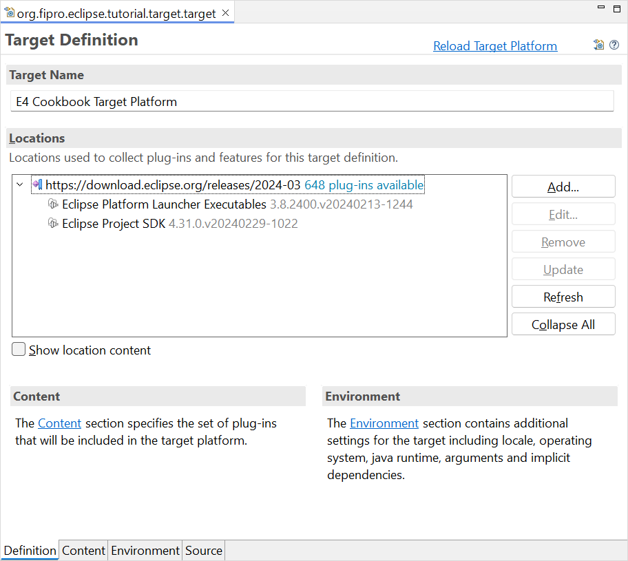
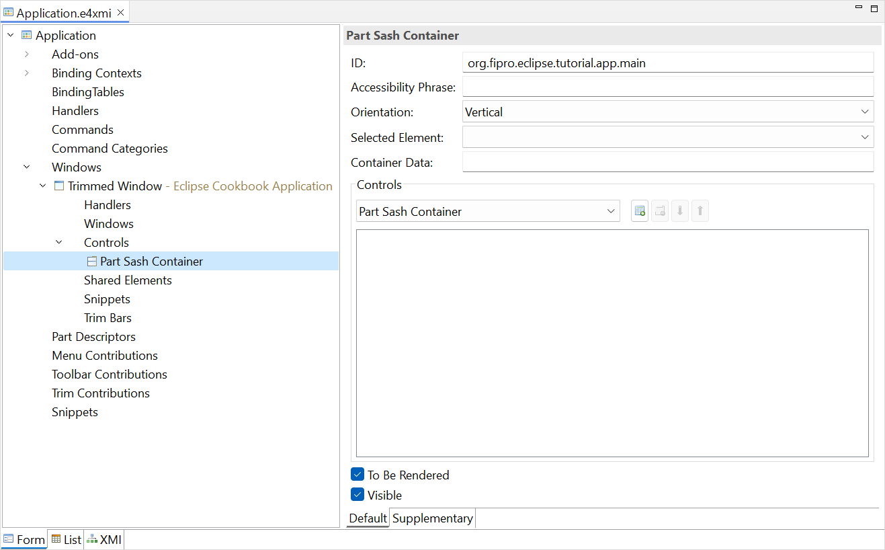
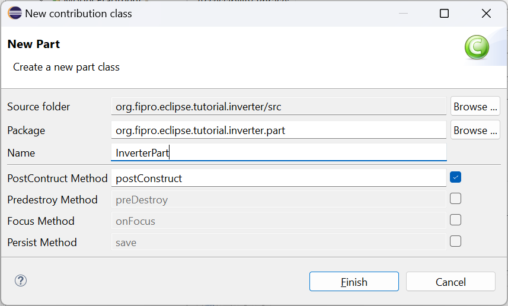
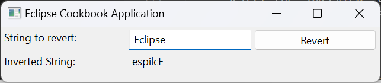

# Eclipse RCP Cookbook – Basic Recipe

With this tutorial we start with the basic recipe. In our case this means to setup the recommended project structure and explain the very basics. It can also be seen as _Getting Started with Eclipse 4 RCP_ without the typical Hello World approach. Please note that despite the project structure, not every implementation detail in the basic recipe is considered to be best practice. We will add some seasoning and extend the basic recipe in further extended recipes.

## Cookware

- JDK >= 17  
    - e.g. [Eclipse Temurin](https://adoptium.net/temurin/releases/)
    - Simply run the executable and follow the installation instructions
- Eclipse IDE >= 2024-03
    - [Eclipse IDE Downloads](https://www.eclipse.org/downloads/)
    - Choose the package that fits your needs the best, e.g. _Eclipse for RCP and RAP Developers_
    - After starting the IDE and choosing a workspace, update the IDE to ensure the latest service release is installed. This is necessary to get the latest bugfixes and security patches.
        - Main Menu → Help → Check for Updates
        
## Ingredients

- Plug-ins for Java and Plug-in development (if they are not already installed with the Eclipse package)
    - Main Menu → Help → Install New Software…
    - Software Site `https://download.eclipse.org/releases/latest`  
(if the Eclipse for RCP and RAP Developers package was chosen, this step is not necessary)
        - _Eclipse Java Development Tools_
        - _Eclipse Plug-in Development Environment_
- Workspace preferences configuration  
The following steps are personal recommended settings that make working with the Eclipse IDE more comfortable.
    - Connect installed JDKs  
This allows you to have a look into the Java sources on debugging
        - _Main Menu → Window → Preferences → Java → Installed JREs → Add…_
        - Select _Standard VM_ → Select a JDK directory e.g. the previously installed JDK 17 → _OK_
        - Click _OK_ on the _Preferences_ dialog
    - Specify Execution Environments
        - _Main Menu → Window → Preferences → Java → Installed JREs → Execution Environments_
        - Select _JavaSE-17_ in the _Execution Environments_ list on the left
        - Select the previously connected JDK 17
        - Click _OK_ on the _Preferences_ dialog
    - Configure to automatically insert braces and semicolons at the correct position for a better fluent typing
        - _Main Menu → Window → Preferences → Java → Editor → Typing → Automatically insert at correct position_
        - Check _Semicolons_
        - Check _Braces_
        - Click _Apply_
    - Configure default actions that should be triggered on Save
        - _Main Menu → Window → Preferences → Java → Editor → Save Actions_
        - Check _Perform the selected actions on save_
        - Check _Organize imports_
        - Check _Additional actions_
        - Click _Apply_
    - Hide AWT classes in the Open Type dialog, content assist and quick fix proposals
        - _Main Menu → Window → Preferences → Java → Appearance → Type Filters_
        - Add Packages… → `java.awt.*`
        - Click _Apply_
    - Ensure to find classes that are available in the target platform but not yet in the plug-in project dependencies
        - _Main Menu → Window → Preferences → Plug-in Development_
        - Check _Include all plug-ins from target in Java search_
        - Click _Apply_
    - Enable DS Annotation processing
        - _Main Menu → Window → Preferences → Plug-in Development → DS Annotations_
        - Check _Generate descriptors from annotated sources_
        - Click _Apply_
    - Plug-in Development perspective
        - Activate the Plug-in Development perspective
        - _Main Menu → Window → Open Perspective → Other… → Plug-in Development_
        
## Preparation

### Step 1: Specify the Target Platform
The target platform specifies the plug-ins and versions that are used to build and needed to run an Eclipse RCP application. If no target platform is specified, the current active one is used, which is the Eclipse IDE you are working with. As an application shouldn’t update when the IDE is updated, it is best practice to always specify and implement against a concrete target platform.

- Create the target platform project
    - _Main Menu → File → New → Project → General → Project_
    - Set name to _org.fipro.eclipse.tutorial.target_
    - Click _Finish_
- Create a new target definition
    - _Right click on project → New → Target Definition_
    - Set the filename to _org.fipro.eclipse.tutorial.target.target_
    - Initialize the target definition with: _Nothing: Start with an empty target definition_
    - Click _Finish_
- Add a new Software Site in the opened _Target Definition Editor_ 
    - Alternative A
        - Switch to the _Source_ tab and add the following snippet to the editor  
    ```
    <target name="E4 Cookbook Target Platform" sequenceNumber="1568034040">
        <locations>
            <location 
                includeAllPlatforms="false" 
                includeConfigurePhase="false"
                includeMode="planner" 
                includeSource="true" 
                type="InstallableUnit">
                
                <unit 
                    id="org.eclipse.equinox.executable.feature.group"
                    version="3.8.2400.v20240213-1244" />
                <unit 
                    id="org.eclipse.sdk.feature.group"
                    version="4.31.0.v20240229-1022" />
                <repository 
                    location="https://download.eclipse.org/releases/2024-03" />
            </location>
        </locations>
    </target>
    ```

    - Alternative B
        - By clicking _Add..._ in the _Locations_ section
        - Select _Software Site_
        - Software Site _https://download.eclipse.org/releases/2024-03_
        - Disable _Group by Category_ and filter for _Eclipse_
        - Select _Eclipse Platform Launcher Executables_
        - Select _Eclipse Project SDK_
        - Click _Finish_
- Switch to the _Definition_ tab
    - Wait until the Target Definition is completely resolved (check the progress at the bottom right)
    - Activate the target platform by clicking _Set as Target Platform_ in the upper right corner of the Target Definition Editor

The Target Definition should look similar to the following screenshot after all steps have been performed.



## Step 2: Create the Application Project

The application project is a plug-in project that contains the application model and global application settings, like for example stylesheets.

- Create the application project
    - _Main Menu → File → New → Plug-in Project_
    - Set _Project name_ to _org.fipro.eclipse.tutorial.app_
    - Click _Next_
    - Set _Name_ to _Eclipse Cookbook Application_
    - Select _Execution Environment_ _JavaSE-17_
	- Check _This plug-in will make contributions to the UI_
	- Set _Create a rich client application?_ to _Yes_
	- Click _Next_
	- Select _Eclipse RCP application_
	- Click _Next_
	- Set _Application window title:_ to _Eclipse Cookbook Application_
    - Click _Finish_
- Delete the generated __icons__ folder and the generated __.product__ file
- Update the _build.properties_ and remove the __icons__ folder from the `bin.includes`

The application model is one of the core parts of an Eclipse 4 application. It describes the structure of an application, including visual elements like windows and parts, as well as non-visual elements like commands, handlers and key bindings. But it does not specify the content of parts or how they are rendered. This way the application model is independent of the UI toolkit implementation.

Technically the application model is stored in an XMI file, that is read on application startup. Since editing a XMI file directly is not much fun, the _Eclipse Model Editor_. By using the _Plug-in Project wizard_ to generate a rich client application, a default application model is created, specifiying the default addons and bindings and a first window to get started with a SWT based Eclipse 4 application.

- Add a part container to the application model
    - Open the application model _Application.e4xmi_ in the _org.fipro.eclipse.tutorial.app_ project
    - Add a container for the part to the window
        - Application → Windows → Trimmed Window → Controls → Add **Part Sash Container**
		- Set _ID_ to _org.fipro.eclipse.tutorial.app.main_

The following picture shows the generated application model.



## Step 3: Create the Plug-in Project

The following plug-in project is used as an example for a content plug-in. It will contain a simple view where a user is able to enter a text and invert it. It anticipates topics like details on the application model, dependency injection and SWT. More details on those topics are covered in later recipes. For the basic recipe simply follow the instructions.

- Create the plug-in project
    - _Main Menu → File → New → Plug-in Project_
    - Set _Project name_ to _org.fipro.eclipse.tutorial.inverter_
    - Click _Next_
    - Ensure that _Generate an Activator_ is disabled
	- Check _This plug-in will make contributions to the UI_
	- Set _Create a rich client application?_ to _No_
	- Click _Finish_
- Open the MANIFEST.MF  
The Plug-in Manifest Editor should open immediately after project creation, to open it afterwards just double click on the file _org.fipro.eclipse.tutorial.inverter/META-INF/MANIFEST.MF_ in the Project Explorer
    - Switch to the _Overview_ tab
        - Check _Activate this plug-in when on of its classes is loaded_  
This is necessary for the *Dynamic Contribution Mode* we will use in the next section, so the plug-in gets activated on model fragment loading.
    - Switch to the _Dependencies_ tab
        - Add the following plug-ins to the _Required Plug-ins_
            - `org.eclipse.swt`
            - `org.eclipse.jface`
        - Add the following packages to the _Imported Packages_
            - `jakarta.annotation`
            - `jakarta.inject`
- Create a simple helper class that contains a method for inverting a given String
    - _Right click on project → New → Class_
    - Set _Package_ to _org.fipro.eclipse.tutorial.inverter.helper_
    - Set _Name_ to _StringInverter_
    - Click _Finish_
    - Create the static helper method `String invert(String)`
	
The created helper method might look similar to the following snippet.

```
package org.fipro.eclipse.tutorial.inverter.helper;
 
public class StringInverter {
 
    private StringInverter() {}
 
    public static String invert(String value) {
        return new StringBuilder(value).reverse().toString();
    }
}
```

- Create a _Model Fragment Definition_  
The application model can be extended by other plug-ins via _Model Fragments_. This allows a clear separation.
    - _Right click on project → New → Other... → Eclipse 4 → Model → New Model Fragment_
	- Select _Contribution Mode_ **Dynamic**
	- Click _Finish_
- Import the *PartSashContainer* from the application model
    - Select _Imports_
	- Select _PartSashContainer_ in the details pane
	- Click on the _Add_ button
	- Select the added _Part Sash Container_
	- Set the _Reference-ID_ to _org.fipro.eclipse.tutorial.app.main_
- Add a _Model Fragment_
    - Right click on _Model Fragments_ and select _Add child - Model Fragment_  

        | Property            | Value                               |
        | ---                 | ---                                 |
        | Extended Element-ID | org.fipro.eclipse.tutorial.app.main |
        | Feature Name        | children |

	- Select _Part_ in the combo
	- Click on the _Add_ button

    - Create the part implementation
        - Click the _Class URI_ link in the part detail view
		- Set the values in the opened dialog

        | Property             | Value                                    |
        | ---                  | ---                                      |
        | Package              | org.fipro.eclipse.tutorial.inverter.part |
        | Name                 | InverterPart                             |
        | PostConstruct Method | check                                    |

        

        - Save the _fragment.e4xmi_ file
        - Create the content in the method annotated with `@PostConstruct`  
Methods annotated with `@PostConstruct` are called after an object has been fully injected and also supports method parameter injection.
            - Use a `GridLayout` for arranging the items
            - Add a `Label` with text `"String to invert:"`
            - Add a `Text` field for inputs
            - Add a `Label` with text `"Inverted String:"`
            - Add a read-only `Text` field to show the output
            - Add a `Button` that will call the helper class method to invert the input value and show the result in the output field

If your are not familiar with SWT, you can use the following snippet as part implementation:

```
package org.fipro.eclipse.tutorial.inverter.part;
 
import jakarta.annotation.PostConstruct;
 
import org.eclipse.jface.layout.GridDataFactory;
import org.eclipse.swt.SWT;
import org.eclipse.swt.events.KeyAdapter;
import org.eclipse.swt.events.KeyEvent;
import org.eclipse.swt.events.SelectionAdapter;
import org.eclipse.swt.events.SelectionEvent;
import org.eclipse.swt.layout.GridLayout;
import org.eclipse.swt.widgets.Button;
import org.eclipse.swt.widgets.Composite;
import org.eclipse.swt.widgets.Label;
import org.eclipse.swt.widgets.Text;
 
import org.fipro.eclipse.tutorial.inverter.helper.StringInverter;
 
public class InverterPart {
 
    @PostConstruct
    public void postConstruct(Composite parent) {
        parent.setLayout(new GridLayout(3, true));
 
        Label inputLabel = new Label(parent, SWT.NONE);
        inputLabel.setText("String to revert:");
        GridDataFactory.fillDefaults().applyTo(inputLabel);
 
        final Text input = new Text(parent, SWT.BORDER);
        GridDataFactory.fillDefaults().grab(true, false).applyTo(input);
 
        Button button = new Button(parent, SWT.PUSH);
        button.setText("Revert");
        GridDataFactory.defaultsFor(button).applyTo(button);
 
        Label outputLabel = new Label(parent, SWT.NONE);
        outputLabel.setText("Inverted String:");
        GridDataFactory.fillDefaults().applyTo(outputLabel);
 
        final Text output = new Text(parent, SWT.READ_ONLY | SWT.WRAP);
        GridDataFactory.fillDefaults().grab(true, true).span(2, 1).applyTo(output);
 
        button.addSelectionListener(new SelectionAdapter() {
            @Override
            public void widgetSelected(SelectionEvent e) {
                output.setText(StringInverter.invert(input.getText()));
            }
        });
 
        input.addKeyListener(new KeyAdapter() {
            @Override
            public void keyPressed(KeyEvent e) {
                if (e.keyCode == SWT.CR
                        || e.keyCode == SWT.KEYPAD_CR) {
                    output.setText(StringInverter.invert(input.getText()));
                }
            }
        });
    }
}
```

### Step 4: Create the Feature Project

A feature describes a list of plug-ins and other features which can be understood as a logical unit. It is therefore used to group plugins. As the mechanism for updating Eclipse applications (p2) only works based on feature projects, it is recommended to create feature based products (see Step 5).

- Create the feature project for our plug-ins
    - _Main Menu → File → New → Feature Project_
    - Set _Project name_ to _org.fipro.eclipse.tutorial.feature_
    - Click _Next_
    - Select the following plug-ins
        - _org.fipro.eclipse.tutorial.app_
        - _org.fipro.eclipse.tutorial.inverter_
    - Click _Finish_

### Step 5: Create the Product Project

A product is used to tie features (or plug-ins) together into a product together with several configurations.

- Create the product project
    - _Main Menu → File → New → Project → General → Project_
    - Set _Project name_ to _org.fipro.eclipse.tutorial.product_
    - Click _Finish_
- Create a new product configuration
    - _Right click on project → New → Product Configuration_
    - Set the filename to _org.fipro.eclipse.tutorial.app.product_
    - Select _Create a configuration file with basic settings_
    - Click _Finish_
- Configure the product
    - Select the _Overview_ tab
        - Set the General Information

        | Property             | Value                                    |
        | ---                  | ---                                      |
        | ID | org.fipro.eclipse.tutorial |
        | Version | 1.0.0.qualifier |
        | Name | Eclipse Cookbook Application |
        | The product includes native launcher artifacts | check |

        - Select the _Product Definition_

        | Property             | Value                                    |
        | ---                  | ---                                      |
        | Product | org.fipro.eclipse.tutorial.app.product |
        | Application | org.eclipse.e4.ui.workbench.swt.E4Application |
        | The product configuration is based on | features |

    - Select the _Contents_ tab
        - Add _org.fipro.eclipse.tutorial.feature_ (our custom plugins)
        - Add _org.eclipse.e4.rcp_ (necessary platform plugins)
        - Click _Add Required_ to add _org.eclipse.emf.ecore_ and _org.eclipse.emf.common_ which are required by _org.eclipse.e4.rcp_

    - Select _Configuration_ tab
        - Set the recommended plug-in start levels by clicking _Add Recommended..._ in the _Start Levels_ section
    - Optional: Select _Launching_ tab
        - Add *–clearPersistedState* to the _Program Arguments_  
Prevents loading a persisted workbench on application startup. This is very helpful while developing an application, as otherwise changes to the application model would not be shown on the next startup for example.

### Step 6: Taste

- Start the application from within the IDE
    - Open the Product Configuration in the _org.fipro.eclipse.tutorial.product_ project
    - Select the _Overview_ tab
    - Click _Launch an Eclipse Application_ in the _Testing_ section

The application should look similar to the following screenshot.

