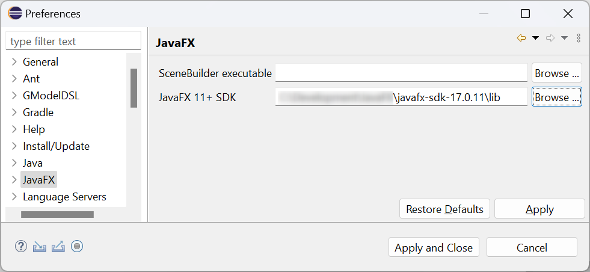
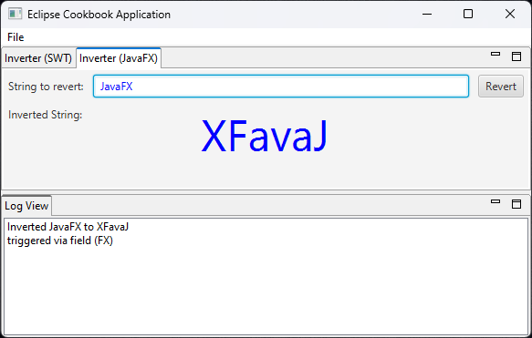

# Eclipse RCP Cookbook – The Veggie Recipe (Add JavaFX controls to an SWT Eclipse 4 application)

As explained in [JavaFX Interoperability with SWT](https://docs.oracle.com/javafx/2/swt_interoperability/jfxpub-swt_interoperability.htm "JavaFX Interoperability with SWT") it is possible to embed JavaFX controls in a SWT UI. This is useful for example if you want to softly migrate big applications from SWT to JavaFX or if you need to add animations or special JavaFX controls without completely migrating your application.

The following recipe will show how to integrate JavaFX with an Eclipse 4 application. It will cover the usage of Java 17 and JavaFX 17.  

**_Note:_**  
If you are interested in the usage of Java 8 with integrated JavaFX, have a look at the older versions of this tutorial, e.g. the one published at [vogella Blog](https://vogella.com/blog/add-javafx-controls-to-a-swt-eclipse-4-application-eclipse-rcp-cookbook-update/).

## Cookware
- JDK >= 17  
    - e.g. [Eclipse Temurin](https://adoptium.net/temurin/releases/)
    - Simply run the executable and follow the installation instructions
- Eclipse IDE >= 2024-03
    - [Eclipse IDE Downloads](https://www.eclipse.org/downloads/)
    - Choose the package that fits your needs the best, e.g. _Eclipse for RCP and RAP Developers_
    - After starting the IDE and choosing a workspace, update the IDE to ensure the latest service release is installed. This is necessary to get the latest bugfixes and security patches.
        - Main Menu → Help → Check for Updates
- e(fx)clipse 3.9.0
    - Update your Eclipse installation
        - _Main Menu → Help → Install New Software..._
        - Use the e(fx)clipse 3.9.0 Update Site _https://download.eclipse.org/efxclipse/updates-released/3.9.0/site_
        - Select _**e(fx)clipse - install / e(fx)clipse - IDE**_ to get the all IDE features installed needed to develop JavaFX within Eclipse ([https://www.eclipse.org/efxclipse/index.html](https://www.eclipse.org/efxclipse/index.html))
    - Restart the IDE and choose a workspace
- JavaFX >= 17
    - [https://openjfx.io/](https://openjfx.io/)
    - Download the JavaFX archive for your operating system
    - Extract it
- e(fx)clipse
    - Configure the JavaFX SDK **_lib_** folder
        - _Main Menu → Window → Preferences → JavaFX_ 
        
        

## Ingredients

This recipe is based on the [Eclipse RCP Cookbook – The Decoration Recipe](Eclipse_RCP_Cookbook_Preferences.md). To get started fast with this recipe, the recipe is prepared for you on GitHub.

To use the prepared recipe, import the project by cloning the Git repository:

- _File → Import → Git → Projects from Git_
- Click _Next_
- Select _Clone URI_
- Enter URI _https://github.com/fipro78/e4-cookbook-basic-recipe.git_
- Click _Next_
- Select the **preferences** branch
- Click _Next_
- Choose a directory where you want to store the checked out sources
- Select _Import existing Eclipse projects_
- Click _Finish_

## Preparation

### Step 1: Update the Target Platform

- Open the target definition _org.fipro.eclipse.tutorial.target.target_ in the project _org.fipro.eclipse.tutorial.target_
- Update the Software Sites in the opened _Target Definition Editor_ 
    - Alternative A
        - Switch to the _Source_ tab and add the following snippet to the editor  
    ```xml
    <?xml version="1.0" encoding="UTF-8" standalone="no"?>
    <?pde?>
    <target name="E4 Cookbook Target Platform" sequenceNumber="1568034040">
        <locations>
            <location 
                includeAllPlatforms="false" 
                includeConfigurePhase="false" 
                includeMode="planner" 
                includeSource="true" 
                type="InstallableUnit">

                <unit 
                    id="org.eclipse.equinox.executable.feature.group" 
                    version="3.8.2400.v20240213-1244"/>
                <unit 
                    id="org.eclipse.sdk.feature.group" 
                    version="4.31.0.v20240229-1022"/>
                    
                <unit 
                    id="org.eclipse.equinox.core.feature.feature.group" 
                    version="1.15.0.v20240214-0846"/>
                <unit 
                    id="org.eclipse.equinox.p2.core.feature.feature.group" 
                    version="1.7.100.v20240220-1431"/>
                    
                <repository 
                    location="https://download.eclipse.org/releases/2024-03"/>
            </location>
            <location 
                includeAllPlatforms="false" 
                includeConfigurePhase="false" 
                includeMode="planner" 
                includeSource="true" 
                type="InstallableUnit">
                
                <unit 
                    id="org.fipro.e4.service.preferences.feature.feature.group" 
                    version="0.4.0.202405151311"/>
                
                <repository 
                    location="https://github.com/fipro78/e4-preferences/raw/master/releases/0.4.0"/>
            </location>
            <location 
                includeAllPlatforms="false" 
                includeConfigurePhase="false" 
                includeMode="planner" 
                includeSource="true" 
                type="InstallableUnit">

                <repository 
                    location="http://download.eclipse.org/efxclipse/runtime-released/3.9.0/site"/>
                <unit 
                    id="org.eclipse.fx.runtime.min.feature.feature.group" 
                    version="3.9.0.202210162353"/>
                <unit 
                    id="org.eclipse.fx.target.rcp4.feature.feature.group" 
                    version="3.9.0.202210170008"/>
            </location>
            <location 
                includeAllPlatforms="false" 
                includeConfigurePhase="false" 
                includeMode="planner" 
                includeSource="true" 
                type="InstallableUnit">

                <repository 
                    location="https://downloads.efxclipse.bestsolution.at/p2-repos/openjfx-17.0.2/"/>
                <unit 
                    id="openjfx.media.feature.feature.group" 
                    version="17.0.2.202204012121"/>
                <unit 
                    id="openjfx.standard.feature.feature.group" 
                    version="17.0.2.202204012121"/>
                <unit 
                    id="openjfx.swt.feature.feature.group" 
                    version="17.0.2.202204012121"/>
                <unit 
                    id="openjfx.web.feature.feature.group" 
                    version="17.0.2.202204012121"/>
            </location>
        </locations>
    </target>
    ```

    - Alternative B
        - Add the e(fx)clipse Runtime extension to add JavaFX support
            - Select _Add..._
            - Select _Software Site_
            - Click _Next_
            - Enter _http://download.eclipse.org/efxclipse/runtime-released/3.9.0/site_ in _Work with:_ for the e(fx)clipse 3.9.0 release build
            - Expand **_FX Target_**
                - Check **_Minimal JavaFX OSGi integration bundles_**
                - Check **_RCP e4 Target Platform Feature_**  
                _(in case additional features provided by e(fx)clipse should be used)_
            - Click _Finish_
        - Add the JavaFX libraries as OSGi bundles  
        _Further information [here](https://github.com/eclipse-efx/efxclipse-eclipse/wiki/Eclipse4-application-on-OpenJFX-11)_
            - Select _Add..._
            - Select _Software Site_
            - Click _Next_
            - Enter _https://downloads.efxclipse.bestsolution.at/p2-repos/openjfx-17.0.2/_ in _Work with:_
            - Disable _Group by Category_ as the items are not categorized and check all available items
                - _**openjfx.media.feature**_ 
                - _**openjfx.standard.feature**_
                - _**openjfx.swt.feature**_
                - _**openjfx.web.feature**_
            - Click _Finish_
- Switch to the _Definition_ tab
    - Wait until the Target Definition is completely resolved (check the progress at the bottom right)
    - Reload and activate the target platform by clicking _Reload Target Platform_ in the upper right corner of the Target Definition Editor

### Step 2: Update the Plug-in project

Instead of changing the `InverterPart` to use a single JavaFX control instead of a SWT control for the output, we add a new `InverterFXPart` that completely uses JavaFX controls. This is a difference to the original blog post.

- Update the application model fragments
    - Open the file _fragment.e4xmi_ in the project _org.fipro.eclipse.tutorial.inverter_
    - Add a _PartStack_
        - Select _Model Fragment Definition → Model Fragments → Model Fragment for PartSashContainer_
        - On the details side select _PartStack_ in the dropdown and click _Add_
        - In the tree view drag the existing _Part_ to the created _PartStack_
        - Select the _Part_ and set _Label_ to _Inverter (SWT)_
        - Select the _PartStack_ in the tree view
        - Select _Part_ in the combo
        - Click on the _Add_ button
            - Set _Label_ to _Inverter (JavaFX)_

        - Create the part implementation
            - Click the _Class URI_ link in the part detail view
            - Set the values in the opened dialog

                | Property             | Value                                    |
                | ---                  | ---                                      |
                | Package              | org.fipro.eclipse.tutorial.inverter.part |
                | Name                 | InverterFXPart                           |
                | PostConstruct Method | check                                    |

            - Click _Finish_
            - Save the _fragment.e4xmi_ file
    - Open the file _fragment.e4xmi_ in the project _org.fipro.eclipse.tutorial.logview_
        - Select _Model Fragment Definition → Model Fragments → Model Fragment for PartSashContainer_
        - Change the value in _Position in list:_ to `after:org.fipro.eclipse.tutorial.inverter.partstack.0` 

    - Implement the `InverterFXPart`
        - Create the content in the method annotated with `@PostConstruct`  
            - Ensure that a `org.eclipse.swt.layout.GridLayout` is set on the parent `Composite`
            - Add a `javafx.embed.swt.FXCanvas` to the parent `Composite` in `InverterFXPart#postConstruct(Composite)`
            - Create an instance of `javafx.scene.layout.GridPane`
            - Create a `javafx.scene.Scene` instance that takes the created `GridPane` as root node and sets the background color to be the same as the background color of the parent `Shell`
            - Set the created `javafx.scene.Scene` to the `FXCanvas`

``` java
GridLayoutFactory.fillDefaults().applyTo(parent);

// add FXCanvas for adding JavaFX controls to the UI
FXCanvas canvas = new FXCanvas(parent, SWT.NONE);
GridDataFactory
    .fillDefaults()
    .grab(true, true)
    .span(3, 1)
    .applyTo(canvas);

// create the root layout pane
GridPane layout = new GridPane();

// create a Scene instance
// set the layout container as root
// set the background fill to the background color of the shell
Scene scene = new Scene(layout, Color.rgb(
    parent.getShell().getBackground().getRed(),
    parent.getShell().getBackground().getGreen(),
    parent.getShell().getBackground().getBlue()));

// set the Scene to the FXCanvas
canvas.setScene(scene);
```

Now JavaFX controls can be added to the scene graph via the `GridPane` instance.

- Create an instance field for the `input` control of type `javafx.scene.control.TextField`
- Create an instance field for the `output` control of type `javafx.scene.control.Label`
- Create an instance field for the `Color` to be used with the controls (needed for the preference support on startup)

```java
TextField input;
Label output;
Color textColor;
```

- Create the user interface with labels and buttons and configure the layout via `javafx.scene.layout.GridPane`
- Add the created controls to the `GridPane`

``` java
// create the controls
Label inputLabel = new Label();
inputLabel.setText("String to revert:");
GridPane.setConstraints(inputLabel, 0, 0);
GridPane.setMargin(inputLabel, new Insets(5.0));

input = new TextField();
input.setStyle("-fx-text-fill: " + (textColor == Color.BLUE ? "blue" : "black") + ";");
GridPane.setConstraints(input, 1, 0);
GridPane.setHgrow(input, Priority.ALWAYS);
GridPane.setMargin(input, new Insets(5.0));

Button button = new Button();
button.setText("Revert");
GridPane.setConstraints(button, 2, 0);
GridPane.setMargin(button, new Insets(5.0));

Label outputLabel = new Label();
outputLabel.setText("Inverted String:");
GridPane.setConstraints(outputLabel, 0, 1);
GridPane.setMargin(outputLabel, new Insets(5.0));

output = new Label();
output.setTextFill(textColor);
GridPane.setConstraints(output, 0, 2);
GridPane.setColumnSpan(output, 3);
GridPane.setHgrow(output, Priority.ALWAYS);
GridPane.setHalignment(output, HPos.CENTER);
		
// don't forget to add children to gridpane
layout.getChildren().addAll(
        inputLabel, input, button, outputLabel, output);
```

Add some animations to see some more JavaFX features:

- Create a `javafx.animation.RotateTransition` that rotates the output label.
- Create a `javafx.animation.ScaleTransition` that scales the output label.
- Create a `javafx.animation.ParallelTransition` that combines the `RotateTransition` and the `ScaleTransition`. This way both transitions are executed in parallel.
- Add starting the animation in the `SelectionAdapter` and the `KeyAdapter` that are executed for reverting a String.

    ``` java
    // add an animation for the output
    RotateTransition rotateTransition = 
            new RotateTransition(Duration.seconds(1), output);
    rotateTransition.setByAngle(360);

    ScaleTransition scaleTransition = 
            new ScaleTransition(Duration.seconds(1), output);
    scaleTransition.setFromX(1.0);
    scaleTransition.setFromY(1.0);
    scaleTransition.setToX(4.0);
    scaleTransition.setToY(4.0);

    ParallelTransition parallelTransition = 
            new ParallelTransition(rotateTransition, scaleTransition);
    ```

Align the functionality with the `InverterPart`:
- Get the `InverterService` and the `IEventBroker` injected

    ```java
    @Inject
    @Service
    private InverterService inverter;

    @Inject
    IEventBroker broker;
    ```

- Add the action listener for the button and the input field
    ```java
    // add the action listener
    button.setOnAction(event -> {
        output.setText(inverter.invert(input.getText()));
        broker.post("TOPIC_LOGGING", "triggered via button (FX)");			
        parallelTransition.play();
    });

    input.setOnAction(event -> {
        output.setText(inverter.invert(input.getText()));
        broker.post("TOPIC_LOGGING", "triggered via field (FX)");
        parallelTransition.play();
    });
    ```

- Add the following method to add the preference support like in the SWT `InverterPart`:
    ```java
	@Inject
	@Optional
	public void setTextColor(
	        @Preference(nodePath = "org.fipro.eclipse.tutorial.inverter", value = "inverter_color") String color) {

	    textColor = "blue".equals(color) 
	            ? Color.BLUE
	            : Color.BLACK;

	    if (input != null) {
	        input.setStyle("-fx-text-fill: " + color + ";");
	    }

	    if (output != null) {
	        output.setTextFill(textColor);
	    }
	}
    ```

### Step 3: Update the Product Configuration

- Open the file _org.fipro.eclipse.tutorial.app.product_ in the project _org.fipro.eclipse.tutorial.product_
- Switch to the _Contents_ tab and add additional features
    - **Option A:** Use the **_Minimal JavaFX OSGi integration bundles_**
        - _org.eclipse.fx.runtime.min.feature_
    - **Option B:** Use the **_RCP e4 Target Platform Feature_**  
    __*Note:*__ As _Include required Features and Plug-ins automatically_ is active, the additional required features and plug-ins will be added automatically. To have more control over the included Features and Plug-ins, disable this option and ensure manually that everything that is required is included.
        - _org.eclipse.fx.target.rcp4.feature_
    - JavaFX OSGi bundles
        - _openjfx.media.feature_
        - _openjfx.standard.feature_
        - _openjfx.swt.feature_
        - _openjfx.web.feature_
- Switch to the _Launching_ tab
    - Add _\-Dosgi.framework.extensions=org.eclipse.fx.osgi_ to the _VM Arguments_ (adapter hook to get JavaFX-SWT integration on the classpath)

## Taste

- Start the application from within the IDE
    - Open the Product Configuration in the _org.fipro.eclipse.tutorial.product_ project
    - Select the _Overview_ tab
    - Click _Launch an Eclipse Application_ in the _Testing_ section

The started application should look similar to the following screenshot.



## Thermomix Update - Maven Tycho build

To build a deliverable product it is recommended to use Maven Tycho. The project was already prepared to build via pomless Tycho in the [Eclipse RCP Cookbook – The Thermomix Recipe](Eclipse_RCP_Cookbook_Tycho.md).

JavaFX is not on the default classpath, therefore the location of the JavaFX libraries need to be configured in the Tycho build for compile time resolution. The OpenJFX libraries are available via Maven Central and can be added as extra classpath elements via Maven. But the `javafx-swt` module is not available via Maven Central as reported [here](https://github.com/javafxports/openjdk-jfx/issues/268). 


That means for OpenJFX 17 following section needs to be added in the `pluginManagement` section, where the **JAVAFX\_HOME** environment variable points to your OpenJFX installation:
```xml
<plugin>
  <groupId>org.eclipse.tycho</groupId>
  <artifactId>tycho-compiler-plugin</artifactId>
  <version>${tycho.version}</version>
  <configuration>
    <encoding>UTF-8</encoding>
    <extraClasspathElements>
      <extraClasspathElement>
        <groupId>org.openjfx</groupId>
        <artifactId>javafx-controls</artifactId>
        <version>17.0.11</version>
      </extraClasspathElement>
      <extraClasspathElement>
        <groupId>org.openjfx</groupId>
        <artifactId>javafx-swt</artifactId>
        <version>17.0.11</version>
        <systemPath>${JAVAFX_HOME}/lib/javafx-swt.jar</systemPath>
        <scope>system</scope>
      </extraClasspathElement>
    </extraClasspathElements>
  </configuration>
</plugin>
```
Start the build

``` console
mvn clean verify
```

The resulting product variants for each platform is located under _e4-cookbook-basic-recipe/org.fipro.eclipse.tutorial.product/target/products_

The currently available re-bundled OpenJFX versions can be found in [this download area](https://downloads.efxclipse.bestsolution.at/p2-repos/). If you are interested about newer OpenJFX versions you can have a look at the [openjfx-osgi](https://github.com/BestSolution-at/openjfx-osgi) repository on GitHub or get in contact with [BestSolution.at](https://www.bestsolution.at/) who created and provide the bundles.

**Note:**  
As an alternative to bundling JavaFX with your application, you can also configure to use externally located JavaFX libraries. For this add **_\-Defxclipse.java-modules.dir=<PATH\_TO\_YOUR\_JAVAFX\_LIBS>_** to the VM Arguments of the Product Configuration. As this approach makes the installation dependent on external states, I did not cover it here. But it is worth to mention as it might be interesting in some cases. There is also a [blog post by Tom Schindl](https://tomsondev.bestsolution.at/2020/01/28/setting-up-efxclipse-rcp-development-for-java11-and-pde/) about JavaFX, Java 11, RCP and PDE.

## Interlude: UI Freeze issue

There is an UI freeze issue related to JavaFX in Eclipse. It is an incompatibility of JavaFX and the _glass.dll_ it tries to load when there are multiple Java versions available, e.g. if you start your application with a Java version that is different to the Java version configured in your PATH system environment variable.

When Eclipse launches it automatically generates an entry for `java.library.path` that contains the path to the Java installation that is used to start Eclipse, and the PATH system environment variable. If another or additional Java installations are on the PATH, the `java.library.path` environment variable contains paths to multiple Java versions. It can then happen that JavaFX loads the _glass.dll_ from the not matching Java installation, which then leads to a `NoSuchMethodError` or similar that cause a crash.

This issue is already reported [here](https://bugs.eclipse.org/bugs/show_bug.cgi?id=540247).

`java.library.path` is a Java environment variable that is used to add additional native libraries to the runtime. It is only used in case native libraries should be added to an application that are loaded inside Java via `System.loadLibrary()`. In Eclipse/OSGi development, native libraries are typically included inside a plug-in project and do not reside external, as this would make the installation dependent on locally installed native libraries on the consumer side. Therefore setting `java.library.path` to an empty value (or an appropriate value in case it is needed) should not have any effect on other functionalities.

- Open the file _org.fipro.eclipse.tutorial.app.product_ in the project _org.fipro.eclipse.tutorial.product_
- Switch to the _Launching_ tab
    - Add _\-Djava.library.path=_ to the _VM Arguments_ (java.library.path will be empty and JavaFX will load the _glass.dll_ from the Java installation that was used to start the application)
