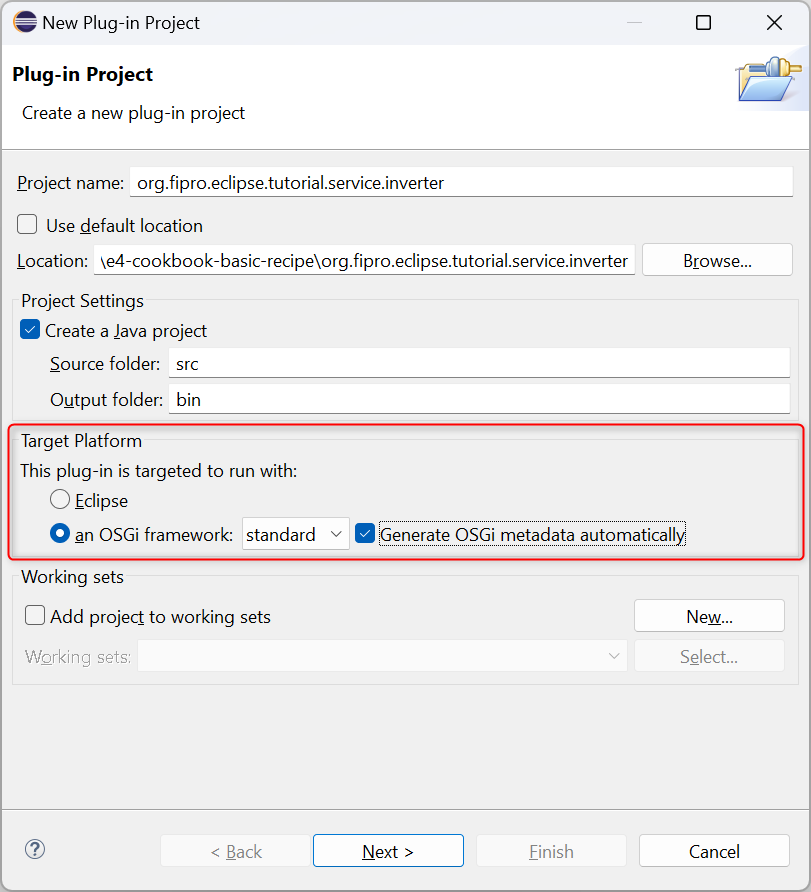
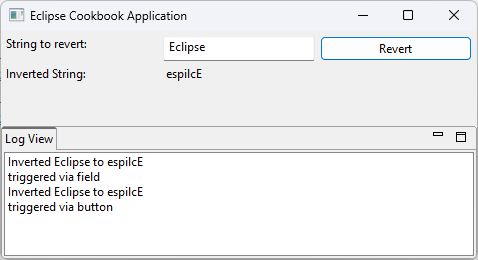

# Eclipse RCP Cookbook – The Food Combining Recipe (OSGi Declarative Services and Events)

OSGi services are used to provide functionality via separate bundles. They are also used to decouple functionality, so it is possible to exchange the implementation at runtime. With the introduction of OSGi declarative services and Eclipse 4 it became more popular to use OSGi services in Eclipse RCP applications.

The communication system in Eclipse 4 is the global event bus. It supports communication between application components and is also used for decoupling, since bundles only need to know the event bus for communication, not the bundles they need to communicate with.

This recipe shows how to create a simple service using OSGi declarative services, how to use the event bus in an Eclipse 4 based application, and how to communicate via event bus in an OSGi service. For this, a part will be added to the application that shows log messages which are sent via event bus.


## Ingredients

This recipe is based on the [Eclipse RCP Cookbook – Basic Recipe](Eclipse_RCP_Cookbook_Basic_Recipe.md). To get started fast with this recipe, the basic recipe is prepared for you on GitHub .

To use the prepared basic recipe, import the project by cloning the Git repository:

- _File → Import → Git → Projects from Git_
- Click _Next_
- Select _Clone URI_
- Enter URI _https://github.com/fipro78/e4-cookbook-basic-recipe.git_
- Click _Next_
- Select the **basic** branch
- Click _Next_
- Choose a directory where you want to store the checked out sources
- Click _Next_
- Select _Import existing Eclipse projects_
- Click _Next_
- Click _Finish_

- Ensure that DS Annotation processing is enabled
    - _Main Menu → Window → Preferences → Plug-in Development → DS Annotations_
    - Check _Generate descriptors from annotated sources_
    - Click _Apply_

**_Note:_**  
With exception to the part implementation, this recipe does not depend on the used UI toolkit. So you can also use the JavaFX version of the basic recipe. If you want to follow this recipe in the JavaFX version, use the following URI to clone the prepared basic recipe: _https://github.com/fipro78/e4-cookbook-basic-recipe-fx.git_.

## Preparation

### Step 1: Create an OSGi Declarative Service

An OSGi service is a Java object instance, registered into an OSGi framework. Any Java object can be registered as a service, but typically it implements a well-known interface. Via OSGi Declarative Services it is possible to define and implement an OSGi service without implementing or extending OSGi framework classes.

The basic recipe uses a static helper class to implement the functionality of inverting a String. In this step a new plug-in is created that contains an OSGi Declarative Service for that purpose. This way it will be possible to exchange the implementation at runtime or mock the implementation for testing.

- Create a new plug-in project
    - _Main Menu → File → New → Plug-in Project_
    - Set name to _org.fipro.eclipse.tutorial.service.inverter_
    - In the _Target Platform_ section select
        - This plug-in is targeted to run with: __*an OSGi framework:*__
        - Select __*standard*__ in the combobox
        - Check __*Generate OSGi metadata automatically*__  
        
    - Click _Next_
    - Set _Name_ to _Inverter Service_
    - Select _Execution Environment JavaSE-17_
    - Ensure that _Generate an Activator_ and _This plug-in will make contributions to the UI_ are disabled
    - Click _Finish_
    - If you do not see the tabs at the bottom of the recently opened editor with name _org.fipro.eclipse.tutorial.service.inverter_, close the editor and open the  _pde.bnd_ file in the project _org.fipro.eclipse.tutorial.service.inverter_.
        - Switch to the _pde.bnd_ tab
            - Add the `Bundle-ActivationPolicy` and the `Automatic-Module-Name` header to get the bundle automatically started
            - Add the `-runee` instruction to create the requirement on Java 17
            ```
            Bundle-Name: Inverter Service
            Bundle-SymbolicName: org.fipro.eclipse.tutorial.service.inverter
            Bundle-Vendor: 
            Bundle-Version: 1.0.0.qualifier
            Bundle-ActivationPolicy: lazy
            Automatic-Module-Name: org.fipro.eclipse.tutorial.service.inverter
            -runee: JavaSE-17
            ```
  - Create an interface for the service definition
    - _Main Menu → File → New → Interface_
        - Source Folder: _org.fipro.eclipse.tutorial.service.inverter/src_
        - Package: _org.fipro.eclipse.tutorial.service.inverter_
        - Name: _InverterService_
    - Add the method definition `String invert(String input);`

    ```
    package org.fipro.eclipse.tutorial.service.inverter;

    public interface InverterService {
        String invert(String input);
    }
    ```
    __*Hint:*__  
    You can also copy the above snippet and paste it in Eclipse when having the `src` folder of the project selected in the _Project Explorer_. This will automatically create the package and the source file at the correct place. 
- Create the service implementation
    - _Main Menu → File → New → Class_
        - Source Folder: _org.fipro.eclipse.tutorial.service.inverter/src_
        - Package: _org.fipro.eclipse.tutorial.service.inverter.impl_
        - Name: _InverterServiceImpl_
        - Interfaces: _org.fipro.eclipse.tutorial.service.inverter.InverterService_
    - Implement the method `String invert(String);`
    - Add the `org.osgi.service.component.annotations.Component` annotation on the class

    ```
    package org.fipro.eclipse.tutorial.service.inverter.impl;

    import org.fipro.eclipse.tutorial.service.inverter.InverterService;
    import org.osgi.service.component.annotations.Component;

    @Component
    public class InverterServiceImpl implements InverterService {

	    @Override
	    public String invert(String input) {
		    return new StringBuilder(input).reverse().toString();
	    }
    }
    ```
- Create the _package-info.java_ file in the `org.fipro.eclipse.tutorial.service.inverter` package.
    - _Right click on the package `org.fipro.eclipse.tutorial.service.inverter` → New → File_
    - Set _File name_ to _package-info.java_
    - Click _Finish_
    - Copy the following code into the editor and save the file

    ```java
    @org.osgi.annotation.bundle.Export(substitution = org.osgi.annotation.bundle.Export.Substitution.NOIMPORT)
    @org.osgi.annotation.versioning.Version("1.0.0")
    package org.fipro.eclipse.tutorial.service.inverter;
    ```

    This configures that the package is exported. If this file is missing, the package is a `Private-Package` and therefore not usable by other OSGi bundles. The `substitution` parameter avoids that the package is used as import inside the same bundle.

## Step 2: Use the OSGi Declarative Service

We will now use the created `InverterService` in the `InverterPart`

- Open the file _META-INF/MANIFEST.MF_ in the project _org.fipro.eclipse.tutorial.inverter_
    - Switch to the _Dependencies_ tab
        - Add the following packages to the _Imported Packages_
            - `org.eclipse.e4.core.di.extensions`
            - `org.fipro.eclipse.tutorial.service.inverter`
- Open the `InverterPart` in _org.fipro.eclipse.tutorial.inverter_
    - Inject the `InverterService` as instance field using `@Inject` and `@Service`
    - Replace the usage of the `StringInverter` helper class with using the `InverterService`

    ```
    public class InverterPart {
	
        @Inject
        @Service
        private InverterService inverter;
        
        @PostConstruct
        public void postConstruct(Composite parent) {
            ...
            
            button.addSelectionListener(new SelectionAdapter() {
                @Override
                public void widgetSelected(SelectionEvent e) {
                    output.setText(inverter.invert(input.getText()));
                }
            });

            input.addKeyListener(new KeyAdapter() {
                @Override
                public void keyPressed(KeyEvent e) {
                    if (e.keyCode == SWT.CR
                            || e.keyCode == SWT.KEYPAD_CR) {
                        output.setText(inverter.invert(input.getText()));
                    }
                }
            });
        }
    }
    ```
    - Delete the `StringInverter` helper class. You can even delete the `org.fipro.eclipse.tutorial.inverter.helper` package
- Update the feature
    - Open the file _feature.xml_ in the project _org.fipro.eclipse.tutorial.feature_
    - Switch to the _Included Plug-ins_ tab
    - Add the plug-in _org.fipro.eclipse.tutorial.service.inverter_ to the list of _Plug-ins and Fragments_

## Step 3: Sending events to the event bus

The Eclipse event service can be used to send events to the event bus. It is implemented via the `IEventBroker` interface and can get injected. In this step the application is modified to send log events on specific actions.

- Update the bundle dependencies
    - Open the file _MANIFEST.MF_ in the project _org.fipro.eclipse.tutorial.inverter_
    - Switch to the _Dependencies_ tab
        - Add the following packages to the _Imported Packages_
            - `org.eclipse.e4.core.services.events`
- Open the `InverterPart` in the project _org.fipro.eclipse.tutorial.inverter_
    - Get the `IEventBroker` injected
    - Modify the listeners on the button and the input field to post an event that contains a String with the log message for the topic `TOPIC_LOGGING`.
    ```
    @Inject
    IEventBroker broker;
    
    @PostConstruct
    public void postConstruct(Composite parent) {
        ...
        button.addSelectionListener(new SelectionAdapter() {
            @Override
            public void widgetSelected(SelectionEvent e) {
                ...
                broker.post("TOPIC_LOGGING", "triggered via button");
            }
        });

        input.addKeyListener(new KeyAdapter() {
			@Override
			public void keyPressed(KeyEvent e) {
                ...
				broker.post("TOPIC_LOGGING", "triggered via field");
			}
		});
    }
    ```

For the JavaFX version this means to add the posting of the event to the _onAction_ `EventHandler`.

```
@Inject
IEventBroker broker;
 
@PostConstruct
public void postConstruct(Composite parent) {
    ...
    button.setOnAction(event -> {
        ...
        broker.post("TOPIC_LOGGING", "triggered via button");
    });
}
```

__*Note:*__  
Via `IEventBroker#post()` the event is sent asynchronously. If you need to send the event synchronously, use `IEventBroker#send()`.

## Step 4: Receiving events from the event bus
The recommended way of receiving events from the event bus is to use dependency injection. Using the annotations `@EventTopic` and `@UIEventTopic` on method parameters will cause method execution, if an event for the specified topic is fired on the event bus. The difference between the two annotations is that using `@UIEventTopic` will execute the method in the UI thread.

In this step a log view is added to the application to show the log messages that were sent to the event bus.

- Create a new plug-in project
    - _Main Menu → File → New → Plug-in Project_
    - Set name to _org.fipro.eclipse.tutorial.logview_
    - In the _Target Platform_ section select
        - This plug-in is targeted to run with: __*Eclipse*__
    - Click _Next_
    - Select _Execution Environment JavaSE-17_
    - Ensure that _Generate an Activator_ and _This plug-in will make contributions to the UI_ are disabled
    - Click _Finish_
- Open the MANIFEST.MF  
    - Switch to the _Overview_ tab
        - Check _Activate this plug-in when on of its classes is loaded_  
    - Switch to the _Dependencies_ tab
        - Add the following plug-ins to the _Required Plug-ins_
            - `org.eclipse.swt`
            - `org.eclipse.jface`
        - Add the following packages to the _Imported Packages_
            - `jakarta.annotation`
            - `jakarta.inject`
            - `org.eclipse.e4.core.di.annotations`
            - `org.eclipse.e4.ui.di`
- Create a _Model Fragment Definition_  
    - _Right click on project → New → Other... → Eclipse 4 → Model → New Model Fragment_
	- Select _Contribution Mode_ **Dynamic**
	- Click _Finish_
- Import the *PartSashContainer* from the application model
    - Select _Imports_
	- Select _PartSashContainer_ in the details pane
	- Click on the _Add_ button
	- Select the added _Part Sash Container_
	- Set the _Reference-ID_ to _org.fipro.eclipse.tutorial.app.main_
- Add a _Model Fragment_
    - Right click on _Model Fragments_ and select _Add child - Model Fragment_  

        | Property            | Value                               |
        | ---                 | ---                                 |
        | Extended Element-ID | org.fipro.eclipse.tutorial.app.main |
        | Feature Name        | children |
        | Position in List    | after:org.fipro.eclipse.tutorial.inverter.part.0 |

        __*Note:*__  
        Via _Position in List_ it is possible to configure where the contribution should be added. The following values are allowed:
        - first
        - index:_&lt;index&gt;_
        - before:_&lt;otherelementid&gt;_
        - after:_&lt;otherelementid&gt;_
- Add a container for the log view part
    - In the details pane of the created _Model Fragment_
        - Select _PartStack_ in the combo
        - Click on the _Add_ button
    - In the details pane of the created _Part Stack_
        - Select _Part_ in the combo
        - Click on the _Add_ button

    - In the details pane of the created _Part_
        - Set the _Label_ to _Log View_
    - Create the part implementation
        - Click the _Class URI_ link in the part detail view
		- Set the values in the opened dialog

        | Property             | Value                                    |
        | ---                  | ---                                      |
        | Package              | org.fipro.eclipse.tutorial.logview.part |
        | Name                 | LogViewPart                             |
        | PostConstruct Method | check                                    |

        - Click _Finish_
        - Save the _fragment.e4xmi_ file
        - Create the content in the method annotated with `@PostConstruct`
            - Create a viewer that is used to show the log messages
            - Create a method that is executed/notified when an event for the topic `TOPIC_LOGGING` is send

The following is an example of a part using SWT:

```
package org.fipro.eclipse.tutorial.inverter.part;

import org.eclipse.e4.core.di.annotations.Optional;
import org.eclipse.e4.ui.di.UIEventTopic;
import org.eclipse.jface.viewers.ListViewer;
import org.eclipse.swt.widgets.Composite;

import jakarta.annotation.PostConstruct;
import jakarta.inject.Inject;

public class LogViewPart {
	 
    ListViewer viewer;
 
    @PostConstruct
    public void postConstruct(Composite parent) {
        viewer = new ListViewer(parent);
    }
 
    @Inject
    @Optional
    void logging(@UIEventTopic("TOPIC_LOGGING") String message) {
        viewer.add(message);
    }
 
}
```

The following is an example of a part using JavaFX:

```
public class LogViewPart {
 
    ListView viewer;
 
    @PostConstruct
    public void postConstruct(BorderPane parent) {
        viewer = new ListView();
        parent.setCenter(viewer);
    }
 
    @Inject
    @Optional
    void logging(@UIEventTopic("TOPIC_LOGGING") String message) {
        viewer.getItems().add(message);
    }
 
}
```

__*Note:*__  
You can also subscribe for events by registering an `org.osgi.service.event.EventHandler` for a topic to the `IEventBroker`. In such a case you also need to take care of unregistering the handler again.

- Update the feature
    - Open the file _feature.xml_ in the project _org.fipro.eclipse.tutorial.feature_
    - Switch to the _Plug-ins_ tab
    - Add the plug-in _org.fipro.eclipse.tutorial.logview_ to the list of _Plug-ins and Fragments_

## Step 4: Send events via OSGi Declarative Service

The `IEventBroker` is not available in the OSGi context, which allows us, for example, to have multiple instances in one application. This also means that it cannot be referenced in an OSGi Declarative Service. But the `IEventBroker` acutually uses the OSGi `EventAdmin` service. Therefore it is possible to send events to the event bus from an OSGi Declarative Service by directly using the `EventAdmin`.

- Open the file _pde.bnd_ file in the project _org.fipro.eclipse.tutorial.service.inverter_  
    - Switch to the _pde.bnd_ tab
        - Add the `buildpath` instruction and add _org.osgi.service.event_ to add it as a project dependency
          ```
          -buildpath: \
            org.osgi.service.event;version=latest
          ```
          __*Note:*__  
          Do not use the _Dependencies_ tab to add dependencies. This will actually create the _Import-Package_ and _Require-Bundle_ headers that are added to the MANIFEST file, instead that the correct headers are generated!
    - Open the `InverterServiceImpl`
    - Add an instance field of type `EventAdmin`
    - Annotate the field with the `@org.osgi.service.component.annotations.Reference` annotation
    - Use the `EventAdmin` in `invertString(String)`
        - Create `Map<String, Object>` for the event properties
        - Put the event topic value to the properties for the key `EventConstants.EVENT_TOPIC`
        - Put the event value to the properties for the key `org.eclipse.e4.data`  
        This is necessary so the event processing works with the E4 injection
        - Create an instance of type `org.osgi.service.event.Event` using the topic and the properties map
    - Post the event via the `EventAdmin`

The finished `InverterServiceImpl` should look similar to the following snippet:

```
package org.fipro.eclipse.tutorial.service.inverter.impl;

import java.util.HashMap;
import java.util.Map;

import org.fipro.eclipse.tutorial.service.inverter.InverterService;
import org.osgi.service.component.annotations.Component;
import org.osgi.service.component.annotations.Reference;
import org.osgi.service.event.Event;
import org.osgi.service.event.EventAdmin;
import org.osgi.service.event.EventConstants;

@Component
public class InverterServiceImpl implements InverterService {

	@Reference
	private EventAdmin eventAdmin;
	
	@Override
	public String invert(String input) {
		String result = new StringBuilder(input).reverse().toString();
		 
        String topic = "TOPIC_LOGGING";
        Map<String, Object> data = new HashMap<>();
        data.put(EventConstants.EVENT_TOPIC, topic);
        data.put("org.eclipse.e4.data", "Inverted " + input + " to " + result);
        Event event = new Event(topic, data);
 
        eventAdmin.postEvent(event);
 
        return result;
	}
}
```

## Taste

Start the application from within the IDE
- Open the Product Configuration in the _org.fipro.eclipse.tutorial.product_ project
- Select the _Overview_ tab
- Click _Launch an Eclipse Application_ in the _Testing_ section

The started application should look similar to the following screenshot.



Further information about OSGi Declarative Services and Event handling:
- [Getting Started with OSGi Declarative Services](https://vogella.com/blog/getting-started-with-osgi-declarative-services/)
- [OSGi Declarative Services news in Eclipse Oxygen](https://vogella.com/blog/osgi-declarative-services-news-in-eclipse-oxygen/)
- [Knopflerfish OSGi Services](http://www.knopflerfish.org/osgi_service_tutorial.html)
- [vogella - OSGi Modularity and Services - Tutorial](http://www.vogella.com/tutorials/OSGiServices/article.html)
- [vogella - Using the event service in Eclipse RCP and OSGi applications](http://www.vogella.com/tutorials/Eclipse4EventSystem/article.html)
- [Eclipse4/RCP/Event Model](https://github.com/eclipse-platform/eclipse.platform.ui/blob/master/docs/Event_Model.md)