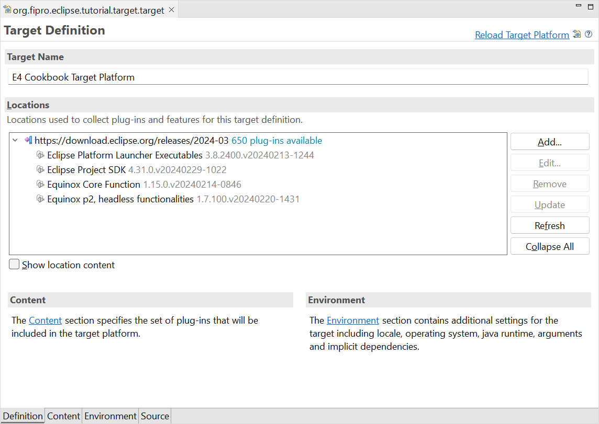

# Eclipse RCP Cookbook – The Topping Recipe (Add p2 update functionality)

Sometimes when you are finished with your recipe, like your favourite cake, you notice that you missed something. Like a topping or a glaze. This can also happen with your Eclipse application. In that case you need a mechanism to update your Eclipse Application, that could be already delivered to your customer, so you can fix bugs or add functionality afterwards.

The Equinox p2 project provides a provisioning infrastructure that can be used to update or install features into an OSGi application.

This recipe will explain and show how to add an update mechanism to an Eclipse 4 application.

## Ingredients

This recipe is based on the [Eclipse RCP Cookbook – The Thermomix Recipe](Eclipse_RCP_Cookbook_Tycho.md). To get started fast with this recipe, the recipe is prepared for you on GitHub .

To use the prepared recipe, import the project by cloning the Git repository:

- _File → Import → Git → Projects from Git_
- Click _Next_
- Select _Clone URI_
- Enter URI _https://github.com/fipro78/e4-cookbook-basic-recipe.git_
- Click _Next_
- Select the **tycho** branch
- Click _Next_
- Choose a directory where you want to store the checked out sources
- Select _Import existing Eclipse projects_
- Click _Finish_

__*Note:*__  
If you see an error saying that the project _org.fipro.eclipse.tutorial.app_ is missing the source folder, create the folder via 
- _Right click on the project → New → Folder_
- Set _Folder name_ to _src_
- Click _Finish_

## Preparation

### Step 1: Update the Target Platform
- Open the target definition _org.fipro.eclipse.tutorial.target.target_ in the project _org.fipro.eclipse.tutorial.target_

- Update the Software Site in the opened _Target Definition Editor_ 
    - Alternative A
        - Switch to the _Source_ tab and add the following snippet to the editor  
    ```xml
    <target name="E4 Cookbook Target Platform" sequenceNumber="1568034040">
        <locations>
            <location 
                includeAllPlatforms="false" 
                includeConfigurePhase="false" 
                includeMode="planner" 
                includeSource="true" 
                type="InstallableUnit">

                <unit 
                    id="org.eclipse.equinox.executable.feature.group" 
                    version="3.8.2400.v20240213-1244"/>
                <unit 
                    id="org.eclipse.sdk.feature.group" 
                    version="4.31.0.v20240229-1022"/>
                    
                <unit 
                    id="org.eclipse.equinox.core.feature.feature.group" 
                    version="1.15.0.v20240214-0846"/>
                <unit 
                    id="org.eclipse.equinox.p2.core.feature.feature.group" 
                    version="1.7.100.v20240220-1431"/>
                    
                <repository 
                    location="https://download.eclipse.org/releases/2024-03"/>
            </location>
        </locations>
    </target>
    ```

    - Alternative B
        - Select the Software Site https://download.eclipse.org/releases/2024-03 in the _Locations_ section
        - Select _Edit..._
        - Disable _Group by category_
        - Filter for _Equinox_
            - Select _Equinox Core Function_
            - Select _Equinox p2, headless functionalities_
        - If the two previous entries are not selected anymore (4 items need to be selected):
            - Filter for _Eclipse_
            - Select _Eclipse Platform Launcher Executables_
            - Select _Eclipse Project SDK_
        - Click _Finish_
- Switch to the _Definition_ tab
    - Wait until the Target Definition is completely resolved (check the progress at the bottom right)
    - Reload and activate the target platform by clicking _Reload Target Platform_ in the upper right corner of the Target Definition Editor

The Target Definition should look similar to the following screenshot after all steps have been performed.



### Step 2: Prepare the application plug-in

To keep it simple, an update handler will be added to the application plug-in that can be triggered via a menu entry in the main menu.

- Update the bundle dependencies
    - Open the file _META-INF/MANIFEST.MF_ in the project _org.fipro.eclipse.tutorial.app_
    - Switch to the _Dependencies_ tab
        - Add the following bundles to the _Required Plug-ins_
            - `org.eclipse.equinox.p2.core`
            - `org.eclipse.equinox.p2.engine`
            - `org.eclipse.equinox.p2.metadata.repository`
            - `org.eclipse.equinox.p2.operations`
- Update the application model
    - Open the file _Application.e4xmi_ in the project _org.fipro.eclipse.tutorial.app_
    - Add a command
        - _Application → Commands → Add_
            - Set _Name_ to _Update_
            - Set _ID_ to _org.fipro.eclipse.tutorial.app.command.update_  
            (will be done automatically on setting the _Name_)
    - Add a handler
        - _Application → Handlers → Add_
            - Set _ID_ to _org.fipro.eclipse.tutorial.app.handler.update_
            - Set the _Command_ reference to _org.fipro.eclipse.tutorial.app.command.update_ via the _Find..._ dialog
            - Create a handler implementation by clicking on the _Class URI_ link
                - Set _Package_ to _org.fipro.eclipse.tutorial.app.handler_
                - Set _Name_ to _UpdateHandler_
                - Click _Finish_  
                __*Note:*__  
                We will implement the `UpdateHandler` in a later step, after the application model changes are done.
    - Add a main menu to the application for making the update command accessible for a user
        - _Application → Windows → Trimmed Window_
        - Check _Main Menu_ in the details view of the _Trimmed Window_
        - Select the now visible _Main Menu_ in the Application Model tree below the _Trimmed Window_
            - Set _ID_ to _org.eclipse.ui.main.menu_
            - Add a _Menu_
                - Set _ID_ to _org.eclipse.ui.file.menu_
                - Set _Label_ to _File_
                - Add a _Handled Menu Item_ to the _File_ menu
                    - Set the _Label_ to _Update_
                    - Set the _Command_ reference to the _Update_ command via _Find..._ dialog
    - Save the changes to the application model

### Step 3: Update the Product Configuration

- Open the file _org.fipro.eclipse.tutorial.app.product_ in the project _org.fipro.eclipse.tutorial.product_
- Switch to the _Contents_ tab
    - Add _org.eclipse.equinox.p2.core.feature_
    - Click _Add Required_ to add the ECF features required by the p2 core feature
- Switch to the _Overview_ tab
- Ensure that a proper version is set to the _Version_ field, e.g. _1.0.0.qualifier_

### Step 4: Implement the update handler

Performing a p2 update basically consists of three steps:

1. Create the update operation that should be performed
2. Check if there are available updates for the specified update operation
3. Perform the update by executing a provisioning job if updates are available

For a good user experience it is best practice to execute those operations in background threads to keep the UI responsive. To keep the focus on p2 updates in this recipe, I will not go into details of background processing via the Eclipse Jobs API here.

You should also consider giving feedback to the user about the update operation results between the steps. For example, if updates are available, the user should be asked whether to perform the update or not.

#### 4.1 Update handler preparation
- Open the `UpdateHandler` class 
- Get the following values injected in `UpdateHandler#execute()`
    - `IProvisioningAgent`  
    OSGi service needed for creating an update operation
    - `UISynchronize`  
    Helper class for executing code in the UI thread
    - `IWorkbench`  
    The current workbench. Will be needed to restart the application.

```java
public class UpdateHandler {
 
    @Execute
    public void execute(
            IProvisioningAgent agent, 
            UISynchronize sync, 
            IWorkbench workbench) {
        ...
    }
 
}
```

#### 4.2 Create the update operation

p2 operations are performed via an `UpdateOperation` instance. To create an `UpdateOperation`, a `ProvisioningSession` is needed, which can be created by providing an `IProvisioningAgent`. As the `IProvisioningAgent` is available as an OSGi service if the necessary bundle was started, it can be simply retrieved via dependency injection.

```java
ProvisioningSession session = new ProvisioningSession(agent);
// update all user-visible installable units
UpdateOperation operation = new UpdateOperation(session);
```

__*Note:*__  
The `UpdateOperation` can also be configured to only update selected installable units.

#### 4.3 Check if there are updates available

Via `UpdateOperation#resolveModal(IProgressMonitor)` you can check whether updates for the installable units are available or not.  It will return an `IStatus` which can be inspected to give feedback to the user.

```java
IStatus status = operation.resolveModal(null);
if (status.getCode() == UpdateOperation.STATUS_NOTHING_TO_UPDATE) {
    MessageDialog.openInformation(
            null, 
            "Information", 
            "Nothing to update");
}
```

__*Note:*__  
Using `null` as `IProgressMonitor` will simply avoid progress reporting. Use an appropriate value if progress reporting should be performed, e.g. via JFace `ProgressMonitorDialog`.

#### 4.4 Check if an update can be performed

Via `UpdateOperation#getProvisioningJob(IProgressMonitor)` the provisioning job can be retrieved to perform the resolved operation. Since it can be `null` under several circumstances, it needs to be checked prior to scheduling.

If a `ProvisioningJob` could be created, it is possible to perform an update. For good UX ask the user whether the update should be performed or not. If yes, start the `ProvisioningJob`. This can either be done via `ProvisioningJob#runModal(IProgressMonitor)` if the job should be executed in the current thread, or `ProvisioningJob#schedule()` if it should be executed asynchronously.

```java
ProvisioningJob provisioningJob = operation.getProvisioningJob(null);
if (provisioningJob != null) {
    sync.syncExec(new Runnable() {

        @Override
        public void run() {
            boolean performUpdate = MessageDialog.openQuestion(
                    null,
                    "Updates available",
                    "There are updates available. Do you want to install them now?");
            if (performUpdate) {
                ...
                provisioningJob.schedule();
            }
        }
    });	
}
else {
    if (operation.hasResolved()) {
            MessageDialog.openError(
                null, 
                "Error", 
                "Couldn't get provisioning job: " + operation.getResolutionResult());
    }
    else {
            MessageDialog.openError(
                null, 
                "Error", 
                "Couldn't resolve provisioning job");
    }
}
```

#### 4.5 Restart the application after the update is finished

After an update was performed, it is good practice to restart the application so the updates are applied correctly. This can be done using `IWorkbench#restart()`.

```java
boolean restart = MessageDialog.openQuestion(null,
    "Updates installed, restart?",
    "Updates have been installed successfully, do you want to restart?");
if (restart) {
    workbench.restart();
}
```

__*Note:*__  
If the `ProvisioningJob` was executed asynchronously via `ProvisioningJob#schedule()`, you need to perform this operation via `IJobChangeListener` attached to the `ProvisioningJob`.

__*Note:*__  
If the update made changes to the application model, it is necessary to clear the persisted state. Otherwise the updates won’t be visible to the user. In the example application an update of the application model works because the `-clearPersistedState` flag is set. Typically this is not the case for productive environments. At the time of writing this blog post, it is only possible to solve this via workarounds, e.g using the [Tom Schindls `RestartService`](https://tomsondev.bestsolution.at/2014/06/17/restarting-an-e4-application-with-the-intial-workbench-e4xmi/). Hopefully such a service will soon make it into the Eclipse platform itself!

The complete `UpdateHandler` using a JFace `ProgressMonitor` can be found on [GitHub](https://github.com/fipro78/e4-cookbook-basic-recipe/blob/p2/org.fipro.eclipse.tutorial.app/src/org/fipro/eclipse/tutorial/app/handler/UpdateHandler.java).

### Step 5: Configure the repository location

To perform update operations, it is necessary to configure the repositories to check against. You need to specify the artifact repositories, which contain the actual content being installed or managed, and the metadata repositories, which contain the installable units (IUs) that describe things that can be installed, the capabilities they provide, and the requirements they have.

__*Note:*__  
The artifact and metadata repositories don’t need to be at the same locations, but typically they are.

It is possible to configure the repositories programmatically via  
`UpdateOperation#getProvisioningContext().setArtifactRepositories(URI[])` and  
`UpdateOperation#getProvisioningContext().setMetadataRepositories(URI[])`.  
But the best practice is to configure them via _p2.inf_ configuration files.

- Create the file _p2.inf_ in the project _org.fipro.eclipse.tutorial.product_
- Add the following lines to configure the repository locations (e.g. _C:/Development/tmp/repository_)

__*Note:*__  
`${#58}` is the variable for ":"

```
instructions.configure=\
  addRepository(type:0,location:file${#58}/C${#58}/Development/tmp/repository);\
  addRepository(type:1,location:file${#58}/C${#58}/Development/tmp/repository/);
```

Further information on how to create and configure a _p2.inf_ file can be found here:

- [Customizing p2 metadata](https://help.eclipse.org/latest/index.jsp?topic=/org.eclipse.platform.doc.isv/guide/p2_customizing_metadata.html)
- [Provisioning Actions and Touchpoints](https://help.eclipse.org/latest/index.jsp?topic=/org.eclipse.platform.doc.isv/guide/p2_actions_touchpoints.html)

### Step 6: Build the product

- Open a console
  - Option A: the console / terminal of your OS
  - Option B: the _Terminal_ view of the Eclipse IDE
    - _Right click on one of the projects → Show in Local Terminal → Terminal_
- Ensure you are in the root folder of the project
- Execute the following command
  ```
  mvn clean verify
  ```

- Copy the product from the subfolder for your environment below _org.fipro.eclipse.tutorial.product/target/products/_ to another directory (e.g. _C:/Development/tmp/app_)

### Step 7: Create an application update

We now create a small modification that we can install as an update to the previously created product.

- Open the file _Application.e4xmi_ in the project _org.fipro.eclipse.tutorial.app_
- Add an exit command
    - _Application → Commands → Add_
        - Set _Name_ to _Exit_
        - Set _ID_ to _org.fipro.eclipse.tutorial.app.command.exit_
- Add an exit handler
    - _Application → Handlers → Add_
        - Set _ID_ to _org.fipro.eclipse.tutorial.app.handler.exit_
        - Set the _Command_ reference to _org.fipro.eclipse.tutorial.app.command.exit_ via _Find..._ dialog
        - Create a handler implementation by clicking on the _Class URI_ link
            - Set _Package_ to _org.fipro.eclipse.tutorial.app.handler_
            - Set _Name_ to _ExitHandler_
            ```java
            @Execute
            public void execute(IWorkbench workbench, Shell shell) {
                if (MessageDialog.openConfirm(shell, "Exit", "Do you want to exit?")) {
                    workbench.close();
                }
            }
            ```
- Add a _Handled Menu Item_ to the _File_ menu
    - Set the _Label_ to _Exit_
    - Set the _Command_ reference to the _Exit_ command via _Find..._ dialog

- Update versions  
As we use pomless Tycho to build the product, the versions in the generated _pom.xml_ files for the modules are derived from the parent _pom.xml_. This means the versions of the plugins, features and product need match to the version in the parent _pom.xml_ file. This can be adjusted either by adding a _pom.xml_ file in each project (which would kind of violate the idea behind pomless Tycho), or to configure the version additionally via _build.properties_ as explained in [Tycho Pomless - Useful Tips](https://github.com/eclipse-tycho/tycho/wiki/Tycho-Pomless#useful-tips).  
  
  For simplicity we update all versions, which can be done by simply executing the `tycho-versions-plugin`.

- Open a console
  - Option A: the console / terminal of your OS
  - Option B: the _Terminal_ view of the Eclipse IDE
    - _Right click on one of the projects → Show in Local Terminal → Terminal_
- Ensure you are in the root folder of the project
- Execute the following command to update the versions

    ```
    mvn org.eclipse.tycho:tycho-versions-plugin:set-version -DnewVersion=1.1.0.qualifier
    ```
- Execute the following command to build the updated product and repository
    ```
    mvn clean verify
    ```

  __*Note:*__  
  If the build fails with the following error message `Unqualified OSGi version 1.0.0.qualifier must match unqualified Maven version 1.1.0-SNAPSHOT for SNAPSHOT builds` simply try to execute the build again. There seems to be a caching issue in Tycho that is responsible for that issue.

- Copy the created repository _org.fipro.eclipse.tutorial.product/target/repository/_ to another directory (e.g. _C:/Development/tmp/repository_)  
  
  __*Note:*__  
  The place should match the entry in the _p2.inf_ file.

## Taste

- Start the application that was exported first, e.g. via _C:/Development/tmp/app/eclipse/eclipse.exe_
- Execute the update via _File → Update_
- Check that an update is performed and that after the restart an _Exit_ menu item is available in the _File_ menu

Following the above steps, it is possible to add a simple update mechanism to an existing Eclipse 4-based application, using plain Equinox p2. With the exception of the JFace dialogs, the above approach can also be used in an e(fx)clipse application.